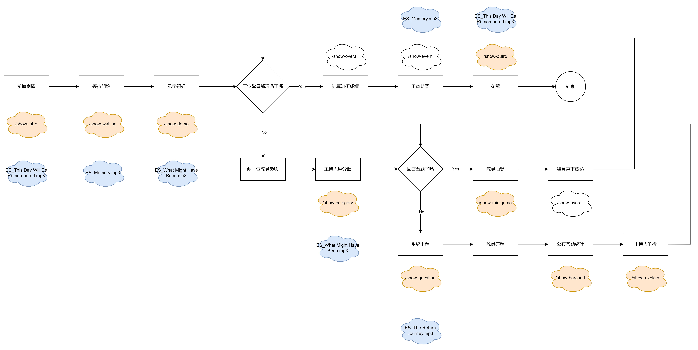

# animated-spoon
小學堂大亂鬥

### 運作流程圖


### 不分類資源整理
- [Get to know Cloud Firestore](https://youtu.be/v_hR4K4auoQ?si=WtwsvK4kqidb-dsK)

### 設定
```sh
# 確認 npm 是否安裝
npm -v

# 安裝 firebase
npm i -g firebase-tools

# login
firebase login
```

### 運行
```sh
# firebase hosting
firebase serve --only hosting

# firebase emulator
firebase emulators:start

# deploy hosting
firebase deploy --only hosting

# deploy functions
firebase deploy --only functions
```

### 舊版封存
1. 解除鎖定作答 / 已經改為 Firebase Functions
```
firebase firestore:delete -f /player-lock-down --recursive
```

### 危險區域
1. 清空玩家作答 (活動開始前)
```
firebase firestore:delete /player-answer-display --recursive
```